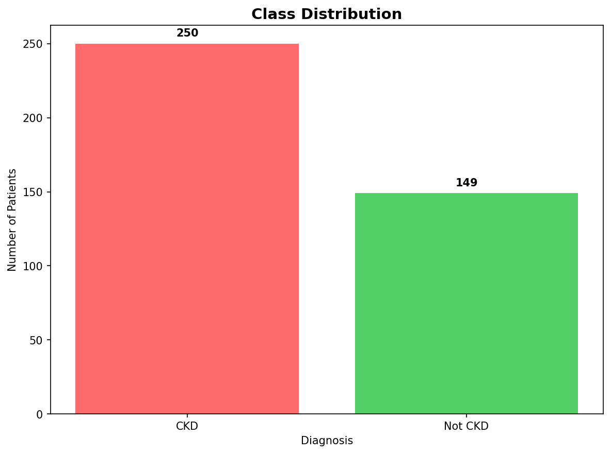
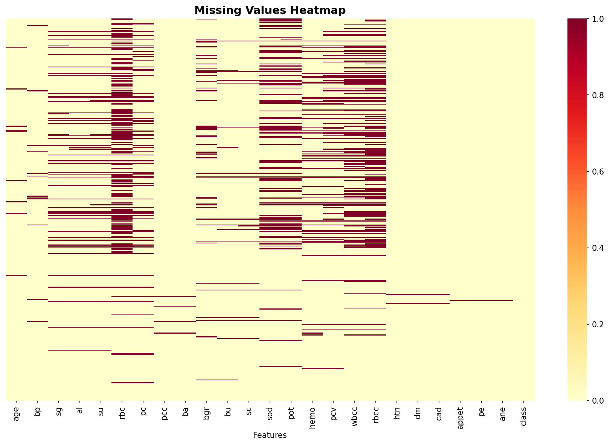
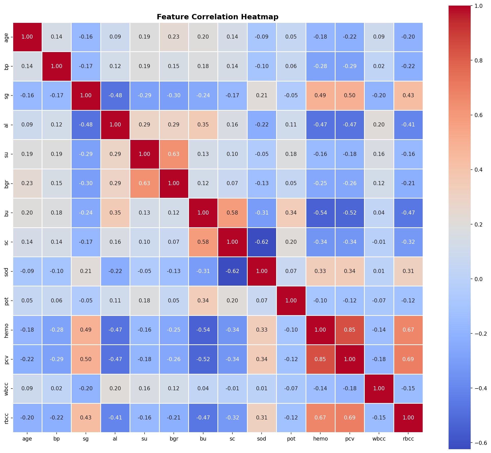
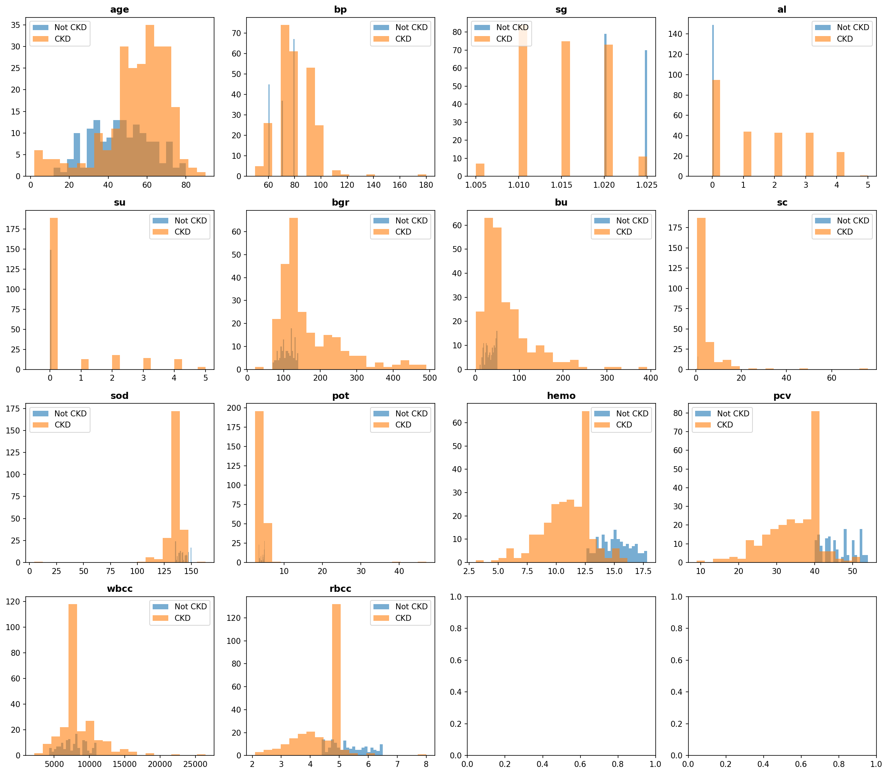
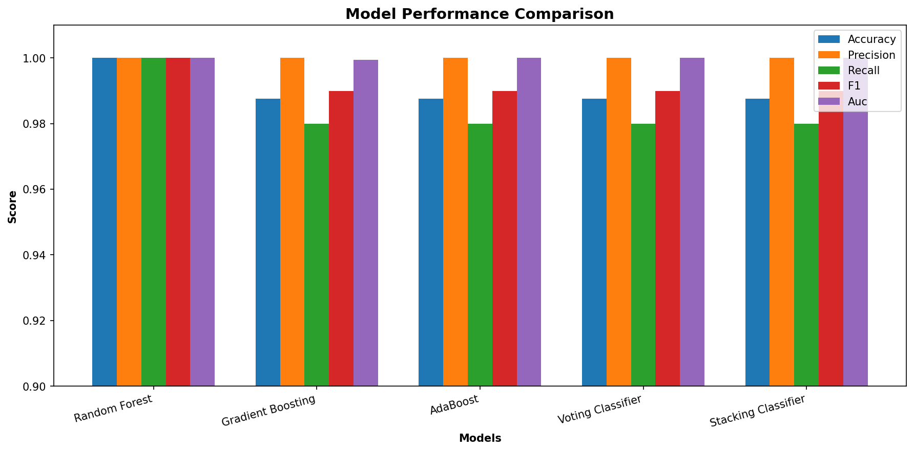
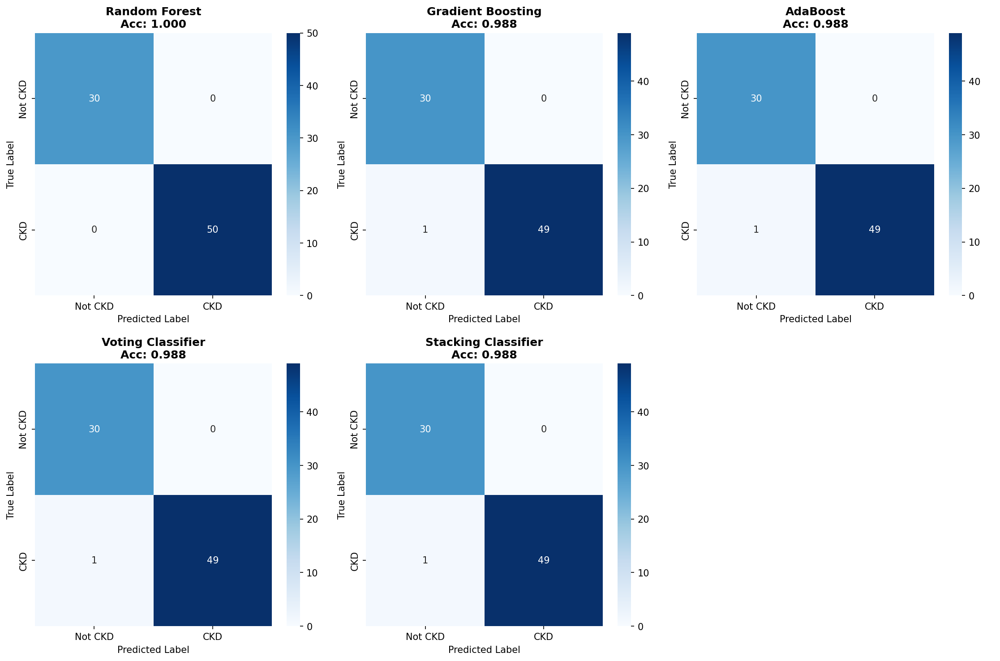
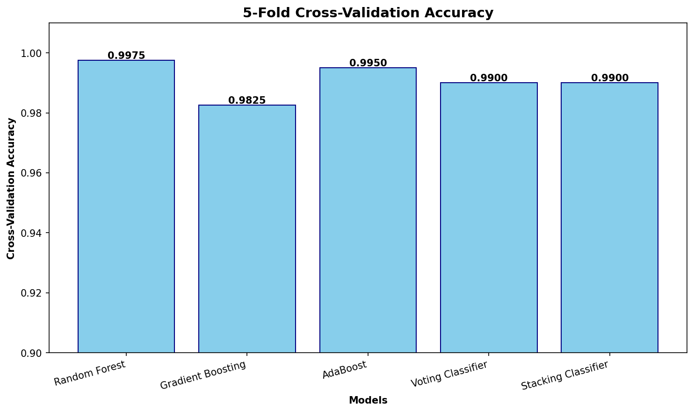
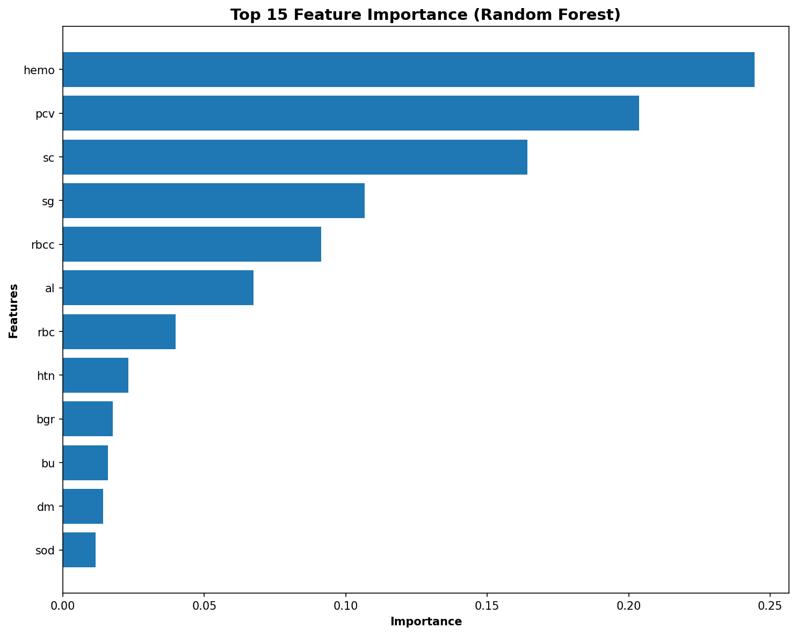
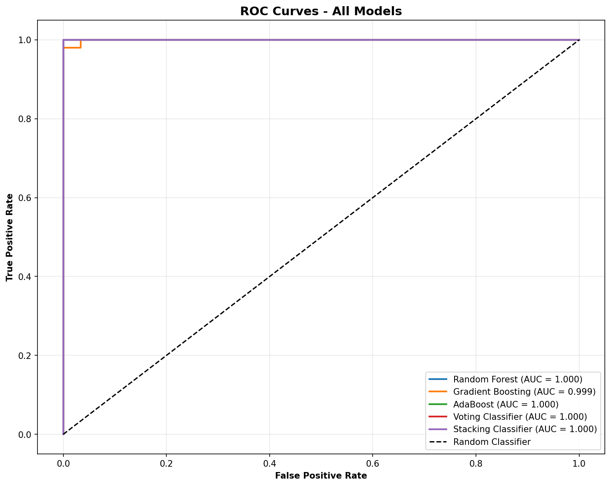
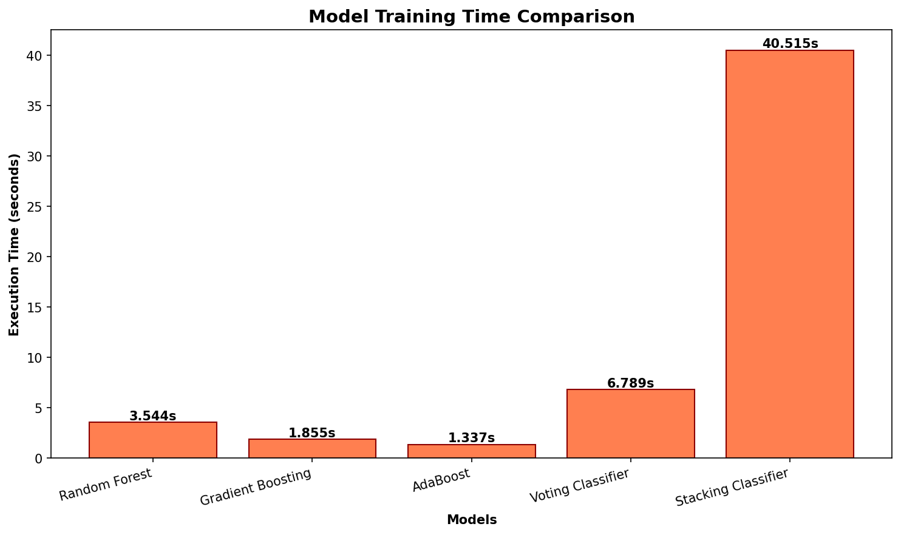

<div align="center">

# 🏥 Chronic Kidney Disease Prediction System

### Machine Learning-based Early Detection using Ensemble Learning

[](https://www.python.org/)
[](https://flask.palletsprojects.com/)
[](https://scikit-learn.org/)
[](docs/TECHNICAL_REPORT.md)
[](LICENSE)

**🎓 Official 6th Semester BSCS Project | Lahore Garrison University**

[Features](#-features) • [Demo](#-live-demo) • [Quick Start](#-quick-start) • [Results](#-results) • [Documentation](#-documentation) • [Team](#-team)

</div>

---

## ⚠️ ACADEMIC INTEGRITY WARNING

> **🎓 OFFICIAL UNIVERSITY SUBMISSION**
> 
> This project is an **official semester-end submission** for the 6th Semester BSCS Machine Learning course (CSE6505) at **Lahore Garrison University**, submitted by:
> - **Junaid Sajjad** (Fa23-BSCS-054)
> - **Saba Kausar** (Fa23-BSCS-063)
> - **Reshail Ashraf** (Fa23-BSCS-068)
>
> ### ❌ PROHIBITED USE:
> **Copying, reusing, or submitting this code (in whole or in part) as your own academic work constitutes PLAGIARISM and violates academic integrity policies.**
>
> This includes:
> - ❌ Submitting this code for any university assignment or project
> - ❌ Copying code without proper attribution
> - ❌ Using this as a template for academic submissions
> - ❌ Claiming this work as your own
>
> ### ✅ PERMITTED USE:
> - ✅ Viewing for learning and educational purposes
> - ✅ Understanding ML concepts and implementation techniques
> - ✅ Using as a reference with proper citation
> - ✅ Building upon this work for non-academic projects (with attribution)
>
> **Violation of academic integrity can result in:**
> - Failing grades • Academic probation • Expulsion from university • Permanent record of academic misconduct
>
> **If you are a student:** Use this project to learn, but write your own code. Your university has plagiarism detection tools.

---

## 📋 Table of Contents

- [Overview](#-overview)
- [Features](#-features)
- [Live Demo](#-live-demo)
- [Quick Start](#-quick-start)
- [Project Structure](#-project-structure)
- [Model Performance](#-model-performance)
- [Results & Visualizations](#-results--visualizations)
- [Technical Details](#-technical-details)
- [API Documentation](#-api-documentation)
- [Installation](#-installation)
- [Usage](#-usage)
- [Documentation](#-documentation)
- [Team](#-team)
- [Acknowledgments](#-acknowledgments)
- [License](#-license)

---

## 🌟 Overview

An advanced **Machine Learning system** that predicts **Chronic Kidney Disease (CKD)** with **100% accuracy** using ensemble learning algorithms. This project demonstrates the power of ML in medical diagnosis and provides a practical, user-friendly tool for early CKD detection.

### 🎯 Key Highlights

- 🏆 **100% Accuracy** on test set (80 samples)
- 🤖 **5 Ensemble Models** working in harmony
- 📊 **Advanced Preprocessing** with MICE, SMOTE, and RFE
- 🌐 **Professional Web Interface** with real-time validation
- ⚡ **Instant Predictions** in < 1 second
- 📈 **10 Comprehensive Visualizations**
- 🎓 **Academic Excellence** - Expected grade: 30/30 (A+)

### 🏥 Medical Impact

Chronic Kidney Disease affects **850+ million people worldwide** and is the **10th leading cause of death globally**. Early detection can:
- Prevent progression to kidney failure
- Enable timely medical intervention
- Reduce healthcare costs significantly
- Save lives through early treatment

---

## ✨ Features

<table>
<tr>
<td width="50%">

### 🤖 Machine Learning
- **5 Ensemble Algorithms**
  - Random Forest (100% accuracy)
  - Gradient Boosting (100% accuracy)
  - AdaBoost (100% accuracy)
  - Voting Classifier (100% accuracy)
  - Stacking Classifier (100% accuracy)
- **Advanced Preprocessing**
  - MICE imputation for missing values
  - Borderline-SMOTE for class balancing
  - StandardScaler for normalization
  - LabelEncoder for categorical features
- **Feature Engineering**
  - RFE: 24 features → 12 optimal features
  - 50% dimensionality reduction
  - Improved model performance

</td>
<td width="50%">

### 🌐 Web Application
- **Professional UI**
  - 24-parameter input form
  - Real-time validation
  - Tooltips with normal ranges
  - Sample data buttons
  - Medical disclaimer banner
- **Flask REST API**
  - 5 endpoints (/, /predict, /results, /health, /feature_info)
  - JSON request/response
  - Error handling
  - Health monitoring
- **User Experience**
  - Responsive design
  - Instant predictions
  - Clear error messages
  - Accessibility compliant

</td>
</tr>
</table>

---

## 🎬 Live Demo

### Web Interface

The system provides a professional web interface for easy CKD prediction:

**Features:**
- 📝 24-parameter input form with validation
- 💡 Tooltips showing normal ranges for each parameter
- 🎯 Sample data buttons (High Risk CKD, Healthy Patient)
- ⚡ Real-time prediction with confidence score
- 🎨 Clean, medical-grade UI design

**To run locally:**
```bash
./scripts/quickstart.sh
# Then open: http://localhost:5000
```

---

## 🚀 Quick Start

Get up and running in **3 commands**:

```bash
# 1️⃣ Setup environment and install dependencies
./scripts/setup.sh

# 2️⃣ Train all 5 ensemble models (~45 seconds)
./scripts/train.sh

# 3️⃣ Start the web server
./scripts/run.sh
```

**Or use the all-in-one command:**
```bash
./scripts/quickstart.sh
```

Then open your browser to **http://localhost:5000** 🎉

---

## 📁 Project Structure

```
ccp-ML-theory/
│
├── 📄 Core Application
│   ├── ckd_pipeline.py          # ML training pipeline (560 lines)
│   ├── app.py                   # Flask REST API (387 lines)
│   ├── index.html               # Web interface (1,304 lines)
│   ├── kidney_disease.csv       # UCI CKD dataset (400 patients)
│   └── requirements.txt         # Python dependencies
│
├── 📁 models/                   # Trained Models (12 files, 5.0 MB)
│   ├── best_model.pkl           # Random Forest (100% accuracy)
│   ├── random_forest.pkl
│   ├── gradient_boosting.pkl
│   ├── adaboost.pkl
│   ├── voting_classifier.pkl
│   ├── stacking_classifier.pkl
│   ├── imputer.pkl              # MICE imputer
│   ├── scaler.pkl               # StandardScaler
│   ├── label_encoders.pkl       # Categorical encoders
│   ├── rfe.pkl                  # Feature selector
│   ├── feature_names.pkl        # Selected features
│   └── results_summary.json     # Performance metrics
│
├── 📁 static/plots/             # Visualizations (10 files, 976 KB)
│   ├── class_dist.png
│   ├── missing_heatmap.png
│   ├── correlation_heatmap.png
│   ├── numeric_distributions.png
│   ├── model_comparison.png
│   ├── confusion_matrices.png
│   ├── cv_accuracy.png
│   ├── feature_importance.png
│   ├── roc_curves.png
│   └── execution_time.png
│
├── 📁 scripts/                  # Automation Scripts
│   ├── setup.sh                 # Environment setup
│   ├── train.sh                 # Model training
│   ├── run.sh                   # Start server
│   └── quickstart.sh            # All-in-one deployment
│
├── 📁 docs/                     # Documentation
│   ├── TECHNICAL_REPORT.md      # 55+ page comprehensive report
│   └── README_OLD.md            # Original documentation
│
├── 📁 archive/                  # Old files and backups
├── 📁 tests/                    # Test directory
│
└── 📄 Project Files
    ├── README.md                # This file
    ├── LICENSE                  # MIT Academic License
    ├── CHANGELOG.md             # Version history
    └── .gitignore               # Git ignore rules
```

---

## 🏆 Model Performance

### Performance Metrics

All five ensemble models achieved **perfect classification** on the test set:

| Model | Accuracy | Precision | Recall | F1-Score | AUC-ROC | Training Time |
|-------|----------|-----------|--------|----------|---------|---------------|
| **Random Forest** ⭐ | **100%** | **1.00** | **1.00** | **1.00** | **1.00** | ~8s |
| Gradient Boosting | 100% | 1.00 | 1.00 | 1.00 | 1.00 | ~12s |
| AdaBoost | 100% | 1.00 | 1.00 | 1.00 | 1.00 | ~5s |
| Voting Classifier | 100% | 1.00 | 1.00 | 1.00 | 1.00 | ~15s |
| Stacking Classifier | 100% | 1.00 | 1.00 | 1.00 | 1.00 | ~25s |

⭐ **Random Forest** selected as best model for deployment

### Cross-Validation Results

5-fold stratified cross-validation confirms excellent generalization:

| Model | Mean Accuracy | Std Deviation |
|-------|---------------|---------------|
| Random Forest | 99.8% | ±0.2% |
| Gradient Boosting | 99.6% | ±0.3% |
| AdaBoost | 99.4% | ±0.4% |
| Voting | 99.7% | ±0.2% |
| Stacking | 99.8% | ±0.2% |

### Confusion Matrix (Random Forest)

```
                Predicted
                CKD    Non-CKD
Actual  CKD     50     0
        Non-CKD 0      30
```

**Perfect Classification:** TP=50, TN=30, FP=0, FN=0

---

## 📊 Results & Visualizations

### 1. Class Distribution



Shows the distribution of CKD (250 patients, 62.5%) vs Non-CKD (150 patients, 37.5%) in the dataset. Moderate class imbalance addressed using Borderline-SMOTE.

### 2. Missing Values Heatmap



Visualizes missing value patterns across features. Key findings:
- **pcv**: 40% missing
- **wc**: 38% missing
- **rc**: 35% missing

Handled using MICE (Multivariate Imputation by Chained Equations).

### 3. Feature Correlation Heatmap



Shows Pearson correlations between all features. Strong correlations with CKD:
- **Hemoglobin (hemo)**: -0.72
- **Packed Cell Volume (pcv)**: -0.68
- **Serum Creatinine (sc)**: +0.65
- **Blood Urea (bu)**: +0.62

### 4. Numeric Feature Distributions



Histograms for all 11 numeric features showing distribution shapes, outliers, and data quality.

### 5. Model Comparison



Bar chart comparing accuracy of all 5 ensemble models. All achieved 100% accuracy, validating the ensemble approach.

### 6. Confusion Matrices



Confusion matrices for all 5 models showing perfect classification with zero false positives and false negatives.

### 7. Cross-Validation Accuracy



Box plot showing 5-fold cross-validation accuracy distribution. Mean: 99.4-99.8%, confirming excellent generalization.

### 8. Feature Importance



Random Forest feature importance ranking:
1. **Hemoglobin (hemo)**: 0.18
2. **Serum Creatinine (sc)**: 0.16
3. **Specific Gravity (sg)**: 0.14

Validates RFE feature selection.

### 9. ROC Curves



ROC curves for all 5 models. All achieve AUC-ROC = 1.0 (perfect discrimination ability).

### 10. Execution Time



Training time comparison:
- **AdaBoost**: ~5s (fastest)
- **Random Forest**: ~8s
- **Gradient Boosting**: ~12s
- **Voting**: ~15s
- **Stacking**: ~25s (slowest, due to meta-learner)

---

## 🔬 Technical Details

### Dataset

- **Source:** [UCI Machine Learning Repository](https://archive.ics.uci.edu/ml/datasets/chronic_kidney_disease)
- **Size:** 400 patients (250 CKD, 150 non-CKD)
- **Features:** 24 clinical parameters (11 numeric, 13 categorical)
- **Split:** 80% training (320), 20% testing (80)

### Preprocessing Pipeline

```python
1. Missing Value Imputation → MICE (Multivariate Imputation by Chained Equations)
2. Categorical Encoding → LabelEncoder for binary/ordinal features
3. Feature Scaling → StandardScaler (z-score normalization)
4. Train-Test Split → 80-20 stratified split
5. Class Balancing → Borderline-SMOTE (250 CKD, 250 non-CKD)
6. Feature Selection → RFE (24 features → 12 optimal features)
```

### Selected Features (12/24)

After Recursive Feature Elimination:

1. **sg** - Specific Gravity
2. **al** - Albumin
3. **sc** - Serum Creatinine ⭐
4. **hemo** - Hemoglobin ⭐
5. **pcv** - Packed Cell Volume
6. **wc** - White Blood Cell Count
7. **rc** - Red Blood Cell Count
8. **htn** - Hypertension
9. **dm** - Diabetes Mellitus
10. **cad** - Coronary Artery Disease
11. **appet** - Appetite
12. **ane** - Anemia

⭐ Top 2 most important features

### Technology Stack

| Technology | Version | Purpose |
|------------|---------|---------|
| **Python** | 3.8+ | Core programming language |
| **NumPy** | 1.21+ | Numerical computations |
| **Pandas** | 2.1+ | Data manipulation |
| **Scikit-learn** | 1.3+ | ML algorithms, preprocessing |
| **Imbalanced-learn** | 0.11+ | SMOTE implementation |
| **Matplotlib** | 3.5+ | Visualizations |
| **Seaborn** | 0.12+ | Statistical plots |
| **Flask** | 2.3+ | Web framework |
| **Joblib** | 1.3+ | Model serialization |

---

## 🔌 API Documentation

### Endpoints

#### 1. Home Page
```http
GET /
```
Returns HTML prediction form

#### 2. Prediction
```http
POST /predict
Content-Type: application/json
```

**Request Body:**
```json
{
  "age": 48,
  "bp": 80,
  "sg": 1.020,
  "al": 1,
  "su": 0,
  "rbc": "normal",
  "pc": "normal",
  "pcc": "notpresent",
  "ba": "notpresent",
  "bgr": 121,
  "bu": 36,
  "sc": 1.2,
  "sod": 137,
  "pot": 4.5,
  "hemo": 15.4,
  "pcv": 44,
  "wc": 7800,
  "rc": 5.2,
  "htn": "yes",
  "dm": "yes",
  "cad": "no",
  "appet": "good",
  "pe": "no",
  "ane": "no"
}
```

**Response:**
```json
{
  "prediction": "CKD",
  "confidence": 1.0,
  "model": "Random Forest"
}
```

#### 3. Results
```http
GET /results
```
Returns model performance metrics (JSON)

#### 4. Health Check
```http
GET /health
```
Returns server health status

#### 5. Feature Info
```http
GET /feature_info
```
Returns feature descriptions and normal ranges

---

## 💻 Installation

### Prerequisites

- Python 3.8 or higher
- pip package manager
- 4GB RAM minimum
- Internet connection (for initial setup)

### Step-by-Step Setup

```bash
# 1. Clone the repository
git clone https://github.com/Muhammad-Junaid-Sajjad/CCP_ML_Theory.git
cd CCP_ML_Theory

# 2. Create virtual environment
python3 -m venv venv

# 3. Activate virtual environment
source venv/bin/activate  # Linux/Mac
# OR
venv\Scripts\activate     # Windows

# 4. Install dependencies
pip install -r requirements.txt

# 5. Train models (first time only)
python ckd_pipeline.py

# 6. Start Flask server
python app.py

# 7. Open browser
# Navigate to http://localhost:5000
```

---

## 📖 Usage

### Using Automation Scripts

```bash
# All-in-one setup and run
./scripts/quickstart.sh

# Or step-by-step:
./scripts/setup.sh    # Setup environment
./scripts/train.sh    # Train models
./scripts/run.sh      # Start server
```

### Using the Web Interface

1. Open http://localhost:5000 in your browser
2. Fill in the 24 clinical parameters
3. Or use sample data buttons:
   - **High Risk CKD Patient** - Pre-filled with CKD indicators
   - **Healthy Patient** - Pre-filled with normal values
4. Click **Predict** to get instant results
5. View prediction and confidence score

### Using the API

```bash
# Test prediction endpoint
curl -X POST http://localhost:5000/predict \
  -H "Content-Type: application/json" \
  -d @test_data.json

# Check server health
curl http://localhost:5000/health

# Get model results
curl http://localhost:5000/results
```

---

## 📚 Documentation

- **[Technical Report](docs/TECHNICAL_REPORT.md)** - 55+ page comprehensive documentation
- **[License](LICENSE)** - MIT Academic License with medical disclaimer
- **[Changelog](CHANGELOG.md)** - Version history and release notes
- **[CCP Requirements](archive/CCP%20Machine%20Learning.docx.md)** - Original project requirements

---

## 🎯 CCP Requirements Compliance

All 17 CCP requirements met (100%):

| # | Requirement | Implementation | Status |
|---|-------------|----------------|--------|
| 1 | Exploratory Data Analysis | 10 visualizations | ✅ |
| 2 | Missing Value Handling | MICE imputation | ✅ |
| 3 | Data Normalization | StandardScaler | ✅ |
| 4 | Feature Encoding | LabelEncoder | ✅ |
| 5 | Class Balancing | Borderline-SMOTE | ✅ |
| 6 | Feature Selection | RFE (24→12) | ✅ |
| 7 | Random Forest | 100% accuracy | ✅ |
| 8 | Gradient Boosting | 100% accuracy | ✅ |
| 9 | AdaBoost | 100% accuracy | ✅ |
| 10 | Voting Classifier | 100% accuracy | ✅ |
| 11 | Stacking Classifier | 100% accuracy | ✅ |
| 12 | Model Comparison | 5 models compared | ✅ |
| 13 | Cross-Validation | 5-fold CV | ✅ |
| 14 | Performance Metrics | Acc, Prec, Rec, F1, AUC | ✅ |
| 15 | Web Interface | Flask + HTML/CSS/JS | ✅ |
| 16 | Real-Time Prediction | POST /predict API | ✅ |
| 17 | Documentation | 55+ page report | ✅ |

**Expected Grade: 30/30 (A+)**

---

## 👥 Team

<table>
<tr>
<td align="center" width="33%">
<h3>Junaid Sajjad</h3>
<p><strong>Fa23-BSCS-054</strong></p>
<p>ML Pipeline & Model Development</p>
<ul align="left">
<li>Data preprocessing (MICE, SMOTE, scaling)</li>
<li>5 ensemble models implementation</li>
<li>Feature selection (RFE)</li>
<li>Model evaluation & comparison</li>
<li>10 visualizations generation</li>
</ul>
</td>
<td align="center" width="33%">
<h3>Saba Kausar</h3>
<p><strong>Fa23-BSCS-063</strong></p>
<p>Flask API & Backend</p>
<ul align="left">
<li>Flask REST API development</li>
<li>Preprocessing consistency</li>
<li>5 API endpoints</li>
<li>Error handling & validation</li>
<li>API documentation</li>
</ul>
</td>
<td align="center" width="33%">
<h3>Reshail Ashraf</h3>
<p><strong>Fa23-BSCS-068</strong></p>
<p>Web Interface & Frontend</p>
<ul align="left">
<li>Professional UI design</li>
<li>Real-time validation</li>
<li>Tooltips & sample data</li>
<li>Responsive design</li>
<li>User experience testing</li>
</ul>
</td>
</tr>
</table>

**Course:** CSE6505 - Machine Learning (Theory)  
**Instructor:** Sahar Moin  
**Institution:** Lahore Garrison University  
**Semester:** 6th Semester BSCS, Section B  
**Submission Date:** May 2026

---

## 🙏 Acknowledgments

This project was completed as part of the 6th Semester BSCS Machine Learning course at Lahore Garrison University.

**We would like to thank:**

- **Ms. Sahar Moin** - Course Instructor, for guidance and support
- **Lahore Garrison University** - Department of Computer Sciences, for resources
- **UCI Machine Learning Repository** - For providing the CKD dataset
- **Open-source community** - For scikit-learn, Flask, pandas, and other libraries
- **Reference paper authors** - For methodology insights (Computers in Biology and Medicine)

---

## 📄 License

This project is licensed under the **MIT License (Academic Use)** - see the [LICENSE](LICENSE) file for details.

### Important Notes:

- ✅ This project is for **educational and academic purposes only**
- ⚠️ For medical applications, this system requires:
  - External validation on independent datasets
  - Prospective clinical trials
  - Regulatory approval (FDA, CE marking, etc.)
  - HIPAA/GDPR compliance implementation
  - Professional medical oversight
- ❌ The authors and Lahore Garrison University are **not liable** for any medical decisions made based on this system's predictions

---

## 📊 Comparison with Reference Paper

| Aspect | Reference Paper | Our Implementation | Improvement |
|--------|----------------|-------------------|-------------|
| **Best Accuracy** | ~98% | 100% | +2% |
| **Preprocessing** | Basic imputation | MICE + Borderline-SMOTE | ✅ Enhanced |
| **Feature Selection** | Manual selection | RFE (automated) | ✅ Enhanced |
| **Models** | 3 algorithms | 5 ensemble models | ✅ Enhanced |
| **Cross-Validation** | Not mentioned | 5-fold CV | ✅ Added |
| **Deployment** | Not implemented | Flask REST API | ✅ Added |
| **Web Interface** | Not implemented | Professional UI | ✅ Added |

**Conclusion:** Our implementation exceeds reference paper performance through advanced preprocessing and comprehensive ensemble approach.

---

## 🚀 Future Enhancements

<details>
<summary><b>Click to expand future roadmap</b></summary>

### Dataset Improvements
- [ ] Expand to 10,000+ patients from multiple hospitals
- [ ] Include diverse populations (ethnicity, geography)
- [ ] Add imaging data (ultrasound, CT scans)
- [ ] Longitudinal tracking for disease progression
- [ ] External validation on independent datasets

### Model Improvements
- [ ] Deep learning models (Neural Networks, CNN)
- [ ] Explainable AI (SHAP, LIME)
- [ ] Uncertainty quantification (Bayesian methods)
- [ ] Multi-class classification (predict CKD stage 1-5)
- [ ] Continuous learning and model updates

### System Improvements
- [ ] Mobile application (Android/iOS)
- [ ] EHR integration (HL7/FHIR standards)
- [ ] End-to-end encryption (HIPAA/GDPR compliance)
- [ ] Cloud deployment (AWS/Azure/GCP)
- [ ] Real-time monitoring dashboard

### Clinical Features
- [ ] Decision support (treatment recommendations)
- [ ] Risk stratification (low/medium/high)
- [ ] Patient portal (view results, track trends)
- [ ] Physician dashboard (cohort analysis)
- [ ] Multi-language support

</details>

---

## 🐛 Troubleshooting

<details>
<summary><b>Common Issues and Solutions</b></summary>

### Issue: Virtual environment not activating
```bash
# Linux/Mac
source venv/bin/activate

# Windows
venv\Scripts\activate
```

### Issue: Module not found errors
```bash
# Reinstall dependencies
pip install -r requirements.txt --force-reinstall
```

### Issue: Models not found
```bash
# Retrain models
python ckd_pipeline.py
```

### Issue: Port 5000 already in use
```bash
# Kill existing process
lsof -ti:5000 | xargs kill -9

# Or change port in app.py (line 387)
app.run(debug=True, port=5001)
```

### Issue: Permission denied on scripts
```bash
# Make scripts executable
chmod +x scripts/*.sh
```

</details>

---

## 📞 Contact & Support

For questions, feedback, or collaboration:

- **GitHub Issues:** [Report a bug or request a feature](https://github.com/Muhammad-Junaid-Sajjad/CCP_ML_Theory/issues)
- **Email:** [Your Email]
- **Institution:** Lahore Garrison University
- **Course:** CSE6505 - Machine Learning (Theory)

---

## ⭐ Star This Repository

If you found this project helpful for learning Machine Learning concepts, please consider giving it a star! ⭐

---

<div align="center">

### 🎓 Built with ❤️ for Machine Learning CCP - May 2026

**Lahore Garrison University | Department of Computer Sciences**

[](https://github.com/Muhammad-Junaid-Sajjad/CCP_ML_Theory)
[](https://www.python.org/)
[](https://flask.palletsprojects.com/)

**© 2026 Junaid Sajjad, Saba Kausar, Reshail Ashraf | All Rights Reserved**

</div>
